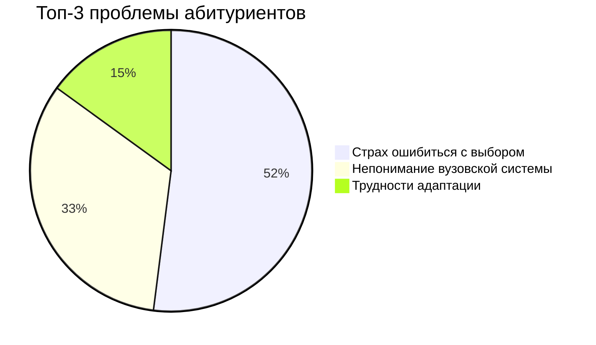

# Идея проекта: Визуальная новелла для абитуриентов 

## 1. Краткое описание
**Интерактивная визуальная новелла**, которая в игровой форме помогает абитуриентам:
- 🎯 Осознанно выбрать вуз и специальность
- 🏫 Понять особенности студенческой жизни
- 💡 Подготовиться к академическим и социальным вызовам

## 2. Проблематика

## 3. Решение: Ключевые особенности

| Компонент   | Описание                  | Пример                          |
|-------------|---------------------------|---------------------------------|
| **Сюжет**   | Ветвящийся сценарий       | разные концовоки                     |
| **Геймплей**| Выборы с последствиями    | "Пойти на пару vs Прогуляться"      |
| **Технологии** | WebGL + React          | Адаптивный дизайн               |

**Пояснения:**
- ✔️ **Сюжет**: Нелинейная история с вариантами развития
- ✔️ **Геймплей**: Система принятия решений влияет на финал
- ✔️ **Контент**: Аутентичные ситуации из вузовской жизни
- ✔️ **Технологии**: Кроссплатформенное веб-решение

## 4.Финансовая модель
barChart
    title Источники монетизации
    x-axis Варианты
    y-axis Потенциал
    bar "Партнерство с вузами" : 70
    bar "Премиум-контент" : 30
    bar "Карьерные рекомендации" : 20
