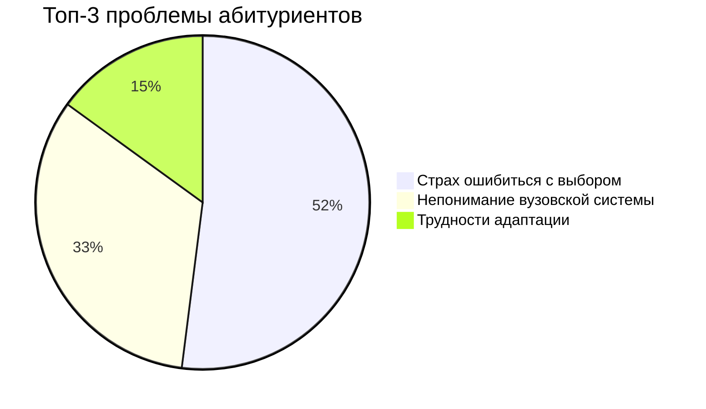

# Идея проекта: Визуальная новелла для абитуриентов 

## 1. Краткое описание
**Интерактивная визуальная новелла**, которая в игровой форме помогает абитуриентам:
- 🎯 Осознанно выбрать вуз и специальность
- 🏫 Понять особенности студенческой жизни
- 💡 Подготовиться к академическим и социальным вызовам

## 2. Целевая аудитория
**Основные группы пользователей:**

| Группа                   | Описание                                                                 | Особенности взаимодействия         |
|--------------------------|--------------------------------------------------------------------------|------------------------------------|
| **Абитуриенты 16-18 лет** | Школьники, выбирающие вуз и специальность                               | Основные пользователи, проходят всю новеллу |
| **Родители абитуриентов** | Помогают детям с выбором образования                                    | Используют сокращенную версию с ключевыми сценами |
| **Кураторы первокурсников** | Преподаватели и тьюторы, работающие с новыми студентами                | Используют как учебный материал   |

## 3. Проблематика

## 4. Решение: Ключевые особенности

| Компонент   | Описание                  | Пример                          |
|-------------|---------------------------|---------------------------------|
| **Сюжет**   | Ветвящийся сценарий       | разные концовоки                     |
| **Геймплей**| Выборы с последствиями    | "Пойти на пару vs Прогуляться"      |
| **Контент** | Реальные кейсы            | Интервью студентов              |
| **Технологии** | WebGL + React          | Адаптивный дизайн               |

**Пояснения:**
- ✔️ **Сюжет**: Нелинейная история с вариантами развития
- ✔️ **Геймплей**: Система принятия решений влияет на финал
- ✔️ **Контент**: Аутентичные ситуации из вузовской жизни
- ✔️ **Технологии**: Кроссплатформенное веб-решение

