# Гипотеза ценностного предложения для визуальной новеллы

## Формулировка гипотезы
> "Мы помогаем **абитуриентам и их родителям** решить **проблему стресса при выборе вуза и неуверенности в адаптации** через **интерактивную визуальную новеллу**, что дает **возможность 'прочувствовать' жизнь студента до поступления**. В отличие от **официальных буклетов и сайтов вузов**, наше решение обеспечивает **эффект погружения через игровые сценарии с выбором и последствиями**."

## Ключевые элементы

### 1.Целевая аудитория
- Абитуриенты (16-18 лет)
- Родители абитуриентов
- Студенты младших курсов (адаптация)

### 2.Решаемые проблемы
1. Страх ошибиться с выбором вуза/специальности
2. Непонимание реальной студенческой жизни
3. Недостаток интерактивных форматов профориентации

### 3.Уникальные преимущества
| Наше решение | Традиционные альтернативы |
|--------------|--------------------------|
| Игровое погружение в контекст | Сухие факты на сайтах вузов |
| Возможность "прожить" разные сценарии | Однообразные дни открытых дверей |
| Эмоциональная вовлеченность | Статичные PDF-буклеты |

## Метрики проверки

### 1.Качественные показатели
- [ ] Отзывы: "После новеллы я увереннее выбрал факультет"
- [ ] Комментарии: "Теперь понимаю, как устроена жизнь в вузе"

### 2.Количественные показатели

```mermaid
%%{init: {'theme': 'base', 'themeVariables': { 'primaryColor': '#ffdfd3', 'edgeLabelBackground':'#fff'}}}%%
gantt
    title Ключевые метрики проверки гипотезы
    dateFormat  X
    axisFormat %s
    section Качественные
    Сбор отзывов          :active, des1, 0, 30
    Интервью (10 чел)      :des2, after des1, 30
    section Количественные
    Прохождение до конца   :crit, met1, 0, 70
    NPS > 40              :met2, after met1, 40
    Рекомендации >30%     :met3, after met2, 30
    section Валидация
    A/B-тест сценариев    :active, val1, 0, 60
    Конверсия в заявления :val2, after val1, 40
```

## Дополнительные возможности
✅ **Для вузов**: инструмент привлечения мотивированных абитуриентов  
✅ **Для родителей**: снижение тревожности за ребенка  
✅ **Для школ**: современный профориентационный инструмент

> **Note**  
> Гипотеза требует проверки через:  
> - Интервью с абитуриентами  
> - A/B-тестирование разных сценариев новеллы  
> - Сбор данных о конверсии в заявления
